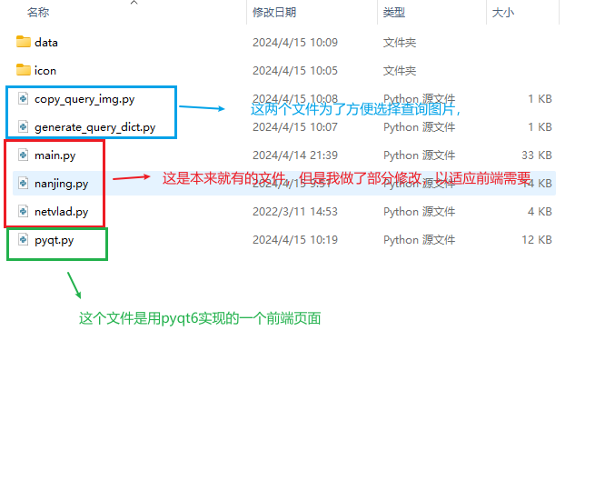
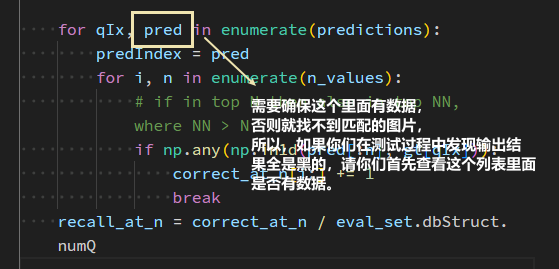
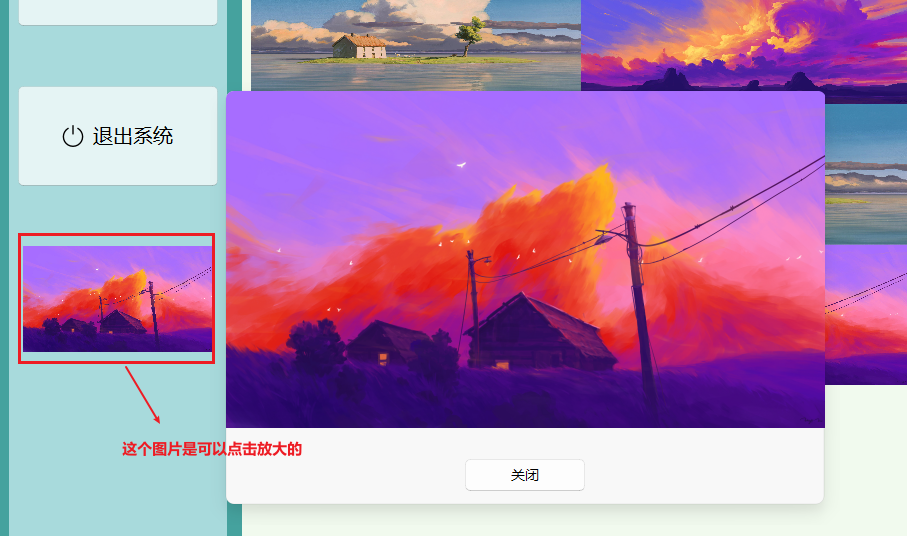
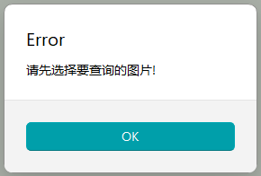

# 使用方法

## 1. 文件复制

首先，将QT_nanjing文件夹下的所有.py文件复制并替换到code_nanjing文件夹中。

QT_nanjing/data文件夹下的所有文件也需要复制到code_nanjing/data文件夹下



## 2. 安装对应的python库

主要就需要安装一些用于前端的python库，如pyqt6,qfluentwidgets等, 安装方法如下：

```bash
pip install PyQt6

pip install PyQt6-Fluent-Widgets -i https://pypi.org/simple/
```

## 3. 构建查询图片库

我们复制到code_nanjing/data下的search文件夹就是用来保存我们的查询图片的，但是这个文件夹是一个空的文件夹，需要执行copy_query_img.py文件，来将query图片复制到该文件夹下

## 4. 一些注意事项

1. 前端只能选择一张图片进行搜索, 不能选择多张图片。

2. 只能从data/search文件夹下选择图片，否则会提示你有错误。

   

3. 数据查询过程中，因为要计算特征，因此会很慢，需要你们提前将特征计算好。

4. 前端只会展示匹配到的前20张图片，请你们确保模型得到的pred值里面有数据

   

## 5. 前端功能展示







